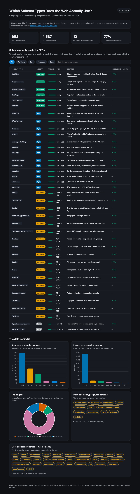

# Schema.org Usage on the Web — Google 2026 Data

Interactive dashboard + analysis of **which Schema.org structured-data types the web actually uses**, built on Google's published usage statistics.



## What this is

[Google publishes](https://schema.org/docs/usage_stats.html) periodic statistics on Schema.org adoption across its crawl of the web. This repo:

- fetches the latest dataset (period `2026_05`),
- reshapes it into tidy CSV + chart-ready JSON,
- renders a standalone, dependency-light dashboard (`index.html`) with **light/dark mode**,
- includes an **interactive SEO priority guide** — sortable, filterable table of which schema types to implement, their real-world adoption tier, best use case, and whether Google has a rich result for them.

### Dashboard features

- **SEO priority guide:** every SEO-relevant type rated Must-have / High / Situational / Niche, with a tier bar showing web adoption. Filter by priority, search by type or use case, sort any column.
- **Light & dark mode:** toggle top-right; respects your OS preference and remembers your choice.
- **Charts:** adoption pyramids for types and properties, long-tail breakdown, most-adopted term lists.

> Priority ratings are editorial guidance layered on Google's adoption data — adoption tiers come straight from the dataset; the Must-have/High/Situational/Niche call is opinion.

## The data — read this first

Each term in the dataset is reported by a **domain-count bucket**, *not* an exact frequency:

| Bucket | Meaning |
|---|---|
| `< 1K` | used on fewer than 1,000 distinct domains |
| `1K - 10K` | 1,000 – 10,000 domains |
| `10K - 100K` | 10,000 – 100,000 domains |
| `100K - 1M` | 100,000 – 1,000,000 domains |
| `1M - 10M` | 1,000,000 – 10,000,000 domains |
| `10M+` | 10,000,000+ domains |

**A higher bucket means wider adoption.** The data does *not* give exact counts, so all charts and copy talk in adoption *tiers*, never precise numbers.

Two `Class` values:
- **`Itemtype`** — a schema *type* (e.g. `Product`, `Organization`, `Recipe`). 958 tracked.
- **`Predicate`** — a schema *property* (e.g. `name`, `price`, `author`). 4,587 tracked.

### Headline numbers (2026_05)

- **12** Itemtypes and **31** properties appear on `10M+` domains.
- **77%** of all tracked terms sit in the `< 1K` long tail.

## Repo layout

```
schema-usage-stats/
├── index.html              # standalone dashboard (data inlined, no build step)
├── src/process.py          # fetch + reshape -> dist/
├── data/                   # raw files from schema.org's GitHub
│   ├── 2026_05.csv
│   └── summary_2026_05.json
├── dist/                   # generated
│   ├── processed.csv       # tidy: class, term, url, bucket
│   └── chart_data.json     # what the dashboard consumes
├── netlify.toml
├── LICENSE
└── README.md
```

## Regenerate

```bash
# fetch latest from schema.org's repo + reprocess
python3 src/process.py

# reprocess only (use already-downloaded data/)
python3 src/process.py --no-fetch
```

Then re-inline the data into the dashboard:

```bash
python3 - <<'PY'
d=open('dist/chart_data.json').read().strip()
h=open('index.html').read()
import re
h=re.sub(r'const DATA = \{.*?\n\};', 'const DATA = '+d+';', h, count=1, flags=re.S)
open('index.html','w').write(h)
PY
```

## View the dashboard

It's a single static file with data inlined, so any static server works:

```bash
python3 -m http.server 4780   # then open http://localhost:4780
```

## Updating to a new period

Schema.org adds new monthly files under
`data/public_stats/google/` in [schemaorg/schemaorg](https://github.com/schemaorg/schemaorg).
Change `PERIOD` at the top of `src/process.py` and rerun.

## Attribution & license

- **Code:** MIT (see [LICENSE](LICENSE)).
- **Data:** Schema.org / Google public usage statistics, CC BY-SA 3.0. Source: <https://schema.org/docs/usage_stats.html>.
- **Charts:** [Chart.js](https://www.chartjs.org/) (MIT).
